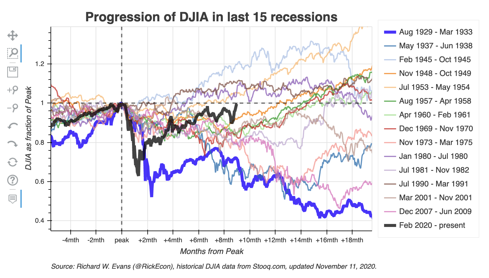
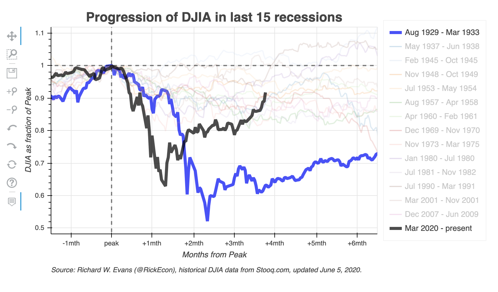
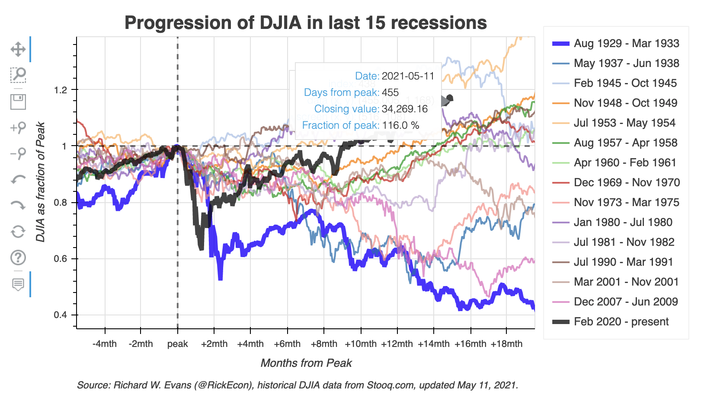
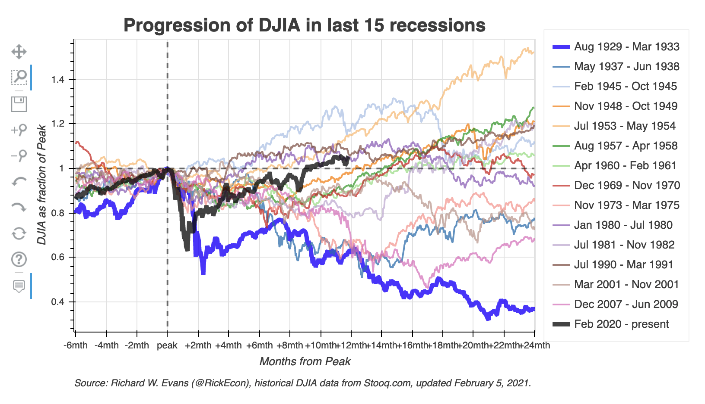

# Normalized Peak Plot of Dow Jones Industrial Average (DJIA)
The code in this repository allows the user to create a normalized peak plot of the Dow Jones Industrial Average (DJIA) over the last 15 recessions, from the Great Depression (Aug. 1929 to Mar. 1933) to the current COVID-19 recession (likely started in March 2020). The dynamic version of this plot, which is updated regularly, is available to manipulate and explore at [https://www.oselab.org/gallery/djia_npp_mth](https://www.oselab.org/gallery/djia_npp_mth). The core maintainer of this repository is [Richard Evans](https://sites.google.com/site/rickecon/) ([@RickEcon](https://github.com/rickecon)).

A normalized peak plot takes the maximum level of the DJIA at the beginning of a recession (within two months of the NBER declared beginning month) and normalizes the entire series so that the value at that peak equals 1.0. As such, the normalized time series shows the percent change from that peak. This is an intuitive way to compare the progression of average stock prices across recessions. The following figure is a screen shot of the normalized peak plot of the DJIA from May 29, 2020.

This `README.md` is organized into the following three sections.
1. [Running the code and generating the dynamic visualization](README.md#1-running-the-code-and-generating-the-dynamic-visualization)
2. [Functionality of the dynamic visualization](README.md#2-functionality-of-the-dynamic-visualization)
3. [Contributing to this visualization code](README.md#3-contributing-to-this-visualization-code)

## 1. Running the code and generating the dynamic visualization
The code for creating this visualization is written in the [Python](https://www.python.org/) programming language. It requires the following two files:
* [`get_djia_data.py`](get_djia_data.py): a Python module that can either retrieve the DJIA data from [Stooq.com](https://stooq.com/) over the internet or retrieve the data from a file saved previously on your local hard drive in the [data](data/) directory of this repository.
* [`djia_npp_bokeh.py`](djia_npp_bokeh.py): a Python script that creates the dynamic visualization of the normalized peak plot of the DJIA over the last 15 recessions. This script calls the [`get_djia_data()`](get_djia_data.py#L33) function from the [`get_djia_data.py`](get_djia_data.py) module. It then uses the [`Bokeh`](https://bokeh.org/) library to create a dynamic visualization using HTML and JavaScript to render the visualization in a web browser.

The most standard way to successfully run this code if you are using the [Anaconda distribution](https://www.anaconda.com/products/individual) of Python is to install and activate the `djia-npp-dev` [conda environment](https://docs.conda.io/projects/conda/en/latest/user-guide/concepts/environments.html) defined in the [environment.yml](environment.yml) file, then run the [`djia_npp_bokeh.py`](djia_npp_bokeh.py) Python script using the appropriate options. Use the following steps.
1. Either fork this repository then clone it to your local hard drive or clone it directly to your local hard drive from this repository.
2. Install the [Anaconda distribution](https://www.anaconda.com/products/individual) of Python to your local machine.
3. Update `conda` and `anaconda` by opening your terminal and typing `conda update conda` and following the instructions, then typing `conda update anaconda` and following the instructions.
4. From the terminal (or Conda command prompt), navigate to the directory to which you cloned this repository and run `conda env create -f environment.yml`. This will create the conda environment with all the necessary dependencies to run the script to create the dynamic visualization.
5. Activate the conda environment by typing in your terminal `conda activate djia-npp-dev`.
6. Run the Python script [`djia_npp_bokeh.py`](djia_npp_bokeh.py) by making the correct modifications to lines 36-56 of the script, then typing `python djia_npp_bokeh.py` in the terminal in the `DJIA_NormPeakPlot` directory.
    * In [line 36](djia_npp_bokeh.py#L36), you can select whether or not you want the data series to go through the current day by setting the `DJIA_end_date_today` boolean to `True` or `False`. If you choose `DJIA_end_date_today = False`, then you must manually set an end date by updating the date values in [lines 42 through 44](djia_npp_bokeh.py#L42).
    * In [line 37](djia_npp_bokeh.py#L37), you can select whether to download the data from [Stooq.com](https://stooq.com/) using the internet or to read in the data from an already saved version of the data in the [`data/`](data/) directory of this repository. If you select `download_from_internet = True`, the script will pass that into the [`get_djia_data()`](get_djia_data.py#L33) function, which will use the ` pandas_datareader` library to download the data from [Stooq.com](https://stooq.com/). If you select `download_from_internet = False`, the script will read in the appropriately named data file from the [`data/`](data/) directory of this repository on your local machine.
    * In [lines 51 through 56](djia_npp_bokeh.py#L51), choose how many months before the peak and after the peak you want to be displayed in the default window that initially is shown in the visualization ([`bkwd_mths_main`](djia_npp_bokeh.py#L52) and [`frwd_mths_main`](djia_npp_bokeh.py#L51)) and how many total months before the peak and after the peak you want to be displayed if the user zooms out ([`bkwd_mths_max`](djia_npp_bokeh.py#L56) and [`frwd_mths_max`](djia_npp_bokeh.py#L55)). Keep in mind that if you extend the total date range beyond `frwd_mths_max = int(12)` and `bkwd_mths_max = int(3)`, you will probably need to update the x-axis labeling frequency in [lines 176-185](djia_npp_bokeh.py#L176).
7. Running the Python script [`djia_npp_bokeh.py`](djia_npp_bokeh.py) will result in three output objects: the dynamic visualization HTML file, the original time series of the DJIA, and the organized dataset of each recession's variables time series for the periods specified in [lines 55 and 56](djia_npp_bokeh.py#L55).
    * [**images/DJIA_NPP_mth_[YYYY-mm-dd].html**](images/DJIA_NPP_mth_2020-05-29.html). This is the dynamic visualization. The code in the file is a combination of HTML and JavaScript. You can view this visualization by opening the file in a web browser window. A version of this visualization is updated regularly on the web at [https://www.oselab.org/gallery/djia_npp_mth](https://www.oselab.org/gallery/djia_npp_mth).
    * [**data/djia_close_[YYYY-mm-dd].csv**](data/djia_close_2020-05-29.csv). A comma separated values data file of the original time series of the DJIA from 1896-05-27 to whatever end date is specified in [lines 36 and 42-44](djia_npp_bokeh.py#L36), which is also the final 10 characters of the file name `YYYY-mm-dd`.
    * [**data/djia_close_pk_[YYYY-mm-dd].csv**](data/djia_close_pk_2020-05-29.csv).

## 2. Functionality of the dynamic visualization
This dynamic visualization allows the user to customize some different views and manipulations of the data using the following functionalities. The default view of the visualization is shown above.
* Highlight or mute specific recession time series by clicking on the series label in the legend on the right side of the plot. The screen shot below shows a version of the plot in which all the recession time series have been muted except for the current COVID-19 recession and the Great Depression. Note that even when muted, the time series are still faintly visible.

* [] Hovertool display. If you select the hovertool button [] on the left side of the plot, which is the default for the plot, information about each point in each time series will be displayed when you hover your cursor over a given point in the plot area. The screen shot below shows a version of the plot in which the hovertool is selected and the information about the minimum point in the current recession is displayed.

* [] Pan different areas of the data. If you click on the pan button [] on the left side of the plot, you can use your cursor to click and drag on the data window and change your view of the data.
* [][][] Zoom in or out on the data. You can zoom in or zoom out on the data series in three different ways. You can use the box zoom functionality by clicking on its button [] on the left side of the plot and clicking and dragging a box on the area of the plot that you want to zoom in on. You can also zoom in by clicking on the zoom in button [] on the left side of the plot, then clicking on the area of the plot you want to center your zoom in around. Or you can zoom out by clicking on the zoom out button [] on the left side of the plot, then clicking on the area of the plot you want to center your zoom out around.The screen shot below shows a zoomed out version of the plot.

* [] Save current view of data as .png file. You can save your current view of the data as a .png file to your local hard drive by clicking on the save button [] on the left side of the plot.
* [][] Undo and redo actions. You can undo or redo any of the plot changes that you make using the undo button [] or the redo button [] on the left side of the plot.
*  Reset the plot. After any changes you make to the plot, you can reset it to its original position by using the reset button  on the left side of the plot.

## 3. Contributing to this visualization code
