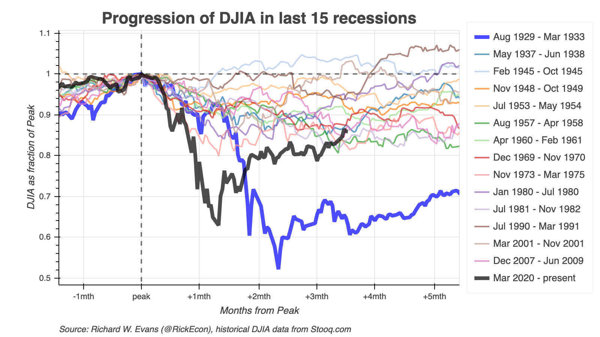

# Normalized Peak Plot of Dow Jones Industrial Average (DJIA)
The code in this repository allows the user to create a normalized peak plot of the Dow Jones Industrial Average (DJIA) over the last 15 recessions, from the Great Depression (Aug. 1929 to Mar. 1933) to the current COVID-19 recession (likely started in March 2020). The dynamic version of this plot, which is updated regularly, is available to manipulate and explore at [https://www.oselab.org/gallery/djia_npp_mth](https://www.oselab.org/gallery/djia_npp_mth).

A normalized peak plot takes the maximum level of the DJIA at the beginning of a recession (within two months of the NBER declared beginning month) and normalizes the entire series so that the value at that peak equals 1.0. As such, the normalized time series shows the percent change from that peak. This is an intuitive way to compare the progression of average stock prices across recessions. The following figure is the normalized peak plot of the DJIA from May 29, 2020.

## Running the code and generating the dynamic visualization
The code for creating this visualization is written in the [Python](https://www.python.org/) programming language. It requires the following two files:
* [`get_djia_data.py`](get_djia_data.py): a Python module that can either retrieve the DJIA data from [Stooq.com](https://stooq.com/) over the internet or retrieve the data from a file saved previously on your local hard drive in the [data](data/) directory of this repository.
* [`djia_npp_bokeh.py`](djia_npp_bokeh.py): a Python script that creates the dynamic visualization of the normalized peak plot of the DJIA over the last 15 recessions. This script calls the [`get_djia_data()`]() function from the [`get_djia_data.py`](get_djia_data.py) module. It then uses the [`Bokeh`](https://bokeh.org/) library to create a dynamic visualization using HTML and JavaScript to render the visualization in a web browser.
